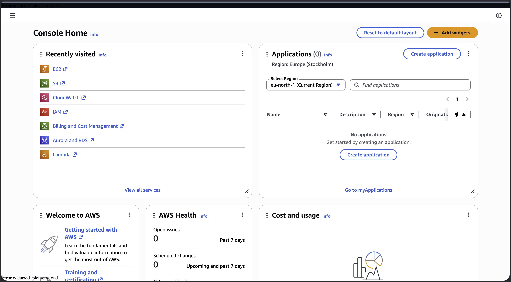
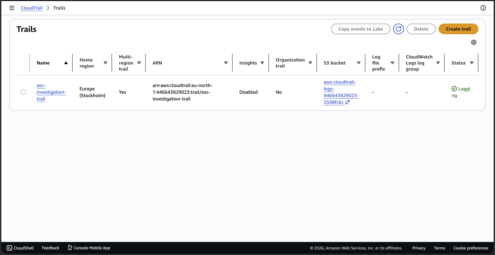
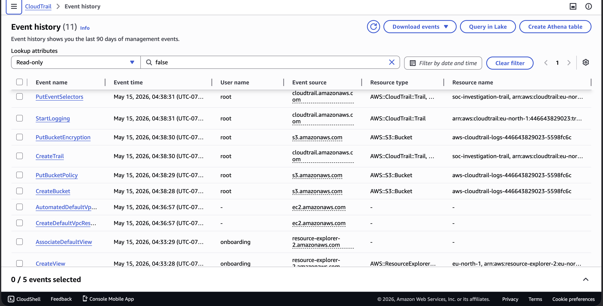
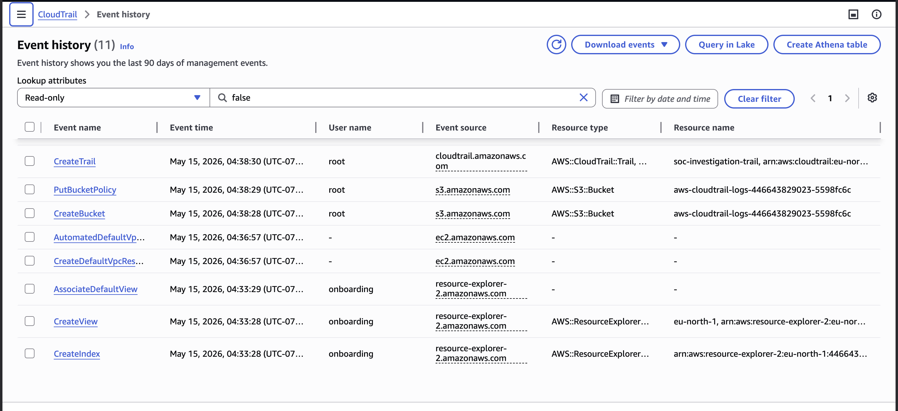
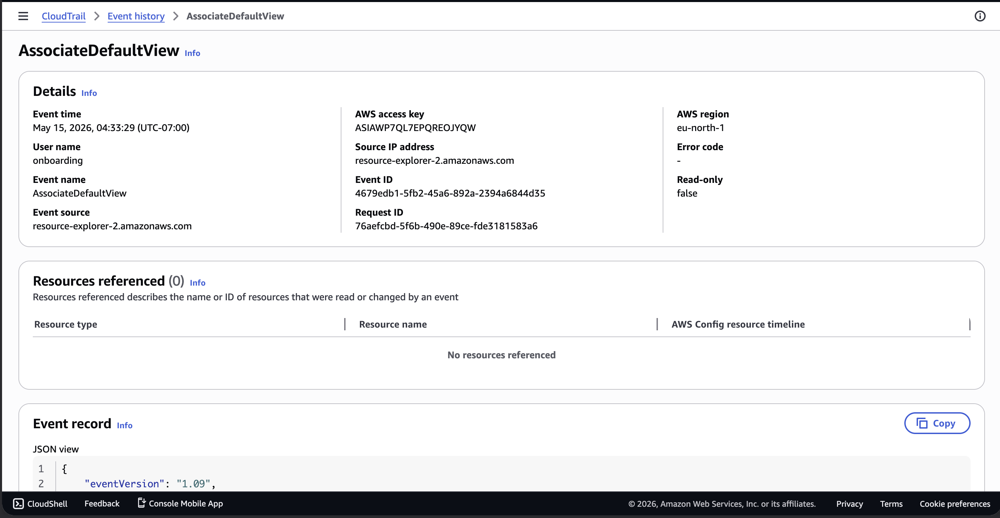
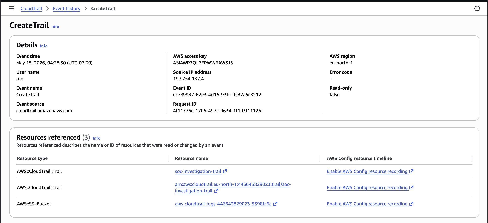
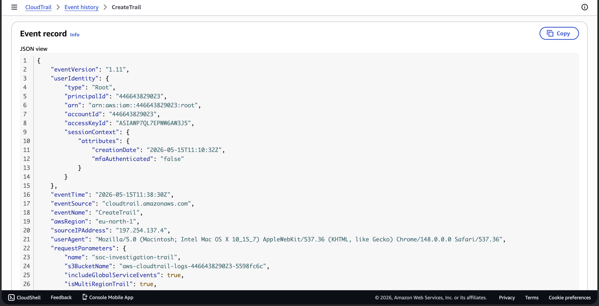

# Day 16 – SOC Tier 1 Incident Report: AWS Cloud Security Investigation Lab

---

## Incident Summary

- **Incident Type:** AWS Cloud Security Investigation CloudTrail Log Analysis
- **Severity:** Medium (Security Misconfigurations Identified)
- **Detection Method:** AWS CloudTrail Event History Analysis + IAM Review
- **Tools Used:** AWS CloudTrail, AWS Console, Event History, JSON Log Analysis
- **Status:** Investigation Complete Misconfigurations Documented

---

## Executive Summary

An AWS cloud security investigation was conducted using AWS CloudTrail to analyse account activity and identify security misconfigurations. A CloudTrail trail named `soc-investigation-trail` was created to capture all management events across all regions. Event history was reviewed and two security findings were identified: the root account was used without MFA authentication, and log file validation was not enabled on the trail. All events were correlated and assessed for suspicious activity.

---

## Affected System

- **Cloud Provider:** Amazon Web Services (AWS)
- **Account ID:** 446643829023
- **Region:** eu-north-1 (Europe Stockholm)
- **Trail Name:** soc-investigation-trail
- **Log Storage:** S3 aws-cloudtrail-logs-446643829023-5598fc6c
- **Events Analysed:** 11 management events

---

## Investigation Methodology

---

### 1. AWS Console Access & CloudTrail Setup



- Logged into AWS Console and navigated to CloudTrail
- Created a multi-region trail named `soc-investigation-trail`
- Confirmed trail status as actively logging

#### SOC Observations:

- CloudTrail is the primary log source for all AWS cloud investigations
- Multi-region trails capture activity across all AWS regions critical for full visibility
- Logs stored in S3 provide a tamper-evident audit trail

---

### 2. CloudTrail Trail Created and Active



- Trail confirmed active with status Logging
- S3 bucket created automatically for log storage
- Multi-region coverage confirmed Yes

#### SOC Observations:

- A SOC analyst should always verify trail status before beginning an investigation
- Disabled trails are a red flag attackers sometimes disable CloudTrail to cover their tracks
- Multi-region trails prevent blind spots in cloud monitoring

---

### 3. Event History Review All 11 Events Analysed





- Reviewed all 11 management events in the last 90 days
- Identified two distinct user identities: root and onboarding
- Confirmed all root actions were performed by the account owner
- Confirmed onboarding activity was AWS internal service not a human

#### SOC Observations:

- Unknown usernames in CloudTrail must always be investigated before clearing
- AWS service roles appear as named users always verify the event source
- Timestamp correlation is critical when multiple users appear in the same window

---

### 4. Suspicious Event Investigation onboarding User



- Investigated AssociateDefaultView event performed by onboarding user
- JSON analysis confirmed user type as AssumedRole AWS service role
- Source IP confirmed as resource-explorer-2.amazonaws.com AWS internal
- Verdict: AWS Resource Explorer service automatically configured not suspicious

#### SOC Observations:

- In cloud investigations always read the full JSON event record not just the username
- AWS service roles invoke API calls that appear as named users in event history
- Source IP of an AWS service domain confirms internal automated activity

---

### 5. Critical Finding Root Account Without MFA





- CreateTrail event performed by root user from IP 197.254.137.4
- JSON confirmed mfaAuthenticated: false root used without MFA
- Log file validation not enabled on the trail
- Root account should never be used for routine tasks in a production environment

#### SOC Observations:

- Root account usage is a critical finding in any cloud security investigation
- MFA on root is the single most important AWS security control
- Log file validation detects tampering with CloudTrail logs should always be enabled

---

## Security Findings Summary

| # | Finding | Severity | Status |
|---|---|---|---|
| 1 | Root account used without MFA | ❌ High | Remediation Required |
| 2 | Log file validation not enabled | ⚠️ Medium | Remediation Required |
| 3 | onboarding user activity | ✅ Clear | AWS internal service verified |
| 4 | CreateDefaultVpc with no username | ✅ Clear | AWS automated activity |

---

## IOCs

| Type | Value | Verdict |
|---|---|---|
| User | root | ⚠️ Used without MFA |
| Source IP | 197.254.137.4 | ✅ Account owner IP |
| User | onboarding | ✅ AWS Resource Explorer service |
| Trail | soc-investigation-trail | ✅ Created for investigation |

---

## MITRE ATT&CK Mapping

| Technique ID | Technique | Finding |
|---|---|---|
| T1078.004 | Valid Accounts: Cloud Accounts | Root account used for management tasks |
| T1530 | Data from Cloud Storage | S3 bucket created for log storage |
| T1562.008 | Disable Cloud Logs | Log file validation disabled logs could be tampered |

---

## SOC Analyst Findings

- 11 CloudTrail events reviewed no unauthorised access detected
- Root account used without MFA critical security misconfiguration
- Log file validation disabled tamper detection not active
- onboarding user confirmed as AWS internal service cleared
- All activity correlated to account owner and AWS automated services

---

## SOC Analyst Response

- Documented all 11 events and their verdicts
- Identified and flagged root MFA as critical remediation item
- Recommended enabling log file validation on soc-investigation-trail
- Recommended creating an IAM admin user for daily tasks instead of root
- Recommended enabling AWS GuardDuty for automated threat detection

---

## Analyst Insight

Cloud security investigations are fundamentally different from on-premise investigations. In AWS, every action leaves a JSON event record in CloudTrail the challenge is not finding the data but knowing what to look for. Root account usage without MFA is the most common critical finding in AWS environments and is the first thing a cloud security analyst checks. A single compromised root account gives an attacker complete control over the entire AWS environment.

---

## Learning Outcome

- Navigate AWS CloudTrail and Event History as a SOC analyst
- Create and configure a multi-region CloudTrail trail
- Read and interpret CloudTrail JSON event records
- Distinguish between AWS service activity and human user activity
- Identify critical cloud security misconfigurations root MFA, log validation
- Map cloud security findings to MITRE ATT&CK framework
- Produce a cloud security incident report with remediation recommendations

---

## Repository Structure

```
aws-cloud-security-investigation-lab/
├── README.md
└── screenshots/
    ├── 01_aws_console_dashboard.png
    ├── 02_cloudtrail_homepage.png
    ├── 03_cloudtrail_create_form.png
    ├── 04_cloudtrail_active.png
    ├── 05_event_history.png
    ├── 06_all_events.png
    ├── 07_event_details_p1.png
    ├── 07_event_details_p2.png
    ├── 07_event_details_p3.png
    ├── 08_createtrail_p1.png
    ├── 08_createtrail_p2.png
    └── 08_createtrail_p3.png
```

---

## Conclusion

This lab demonstrates a real-world AWS cloud security investigation workflow. AWS CloudTrail was configured and all management events were reviewed and assessed. Two security misconfigurations were identified root account usage without MFA and disabled log file validation. All activity was correlated and verdicts were documented. This mirrors the exact process a cloud SOC analyst or cloud security engineer follows when investigating suspicious activity in an AWS environment.
